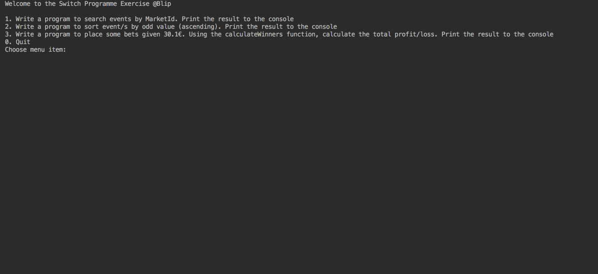

<p align="center">
  
</p>

## Bet:

This is what a bet is all about

## Demo



  ### Competition:

    - Has a name
    - Has one or more events

  ### Event:

    - Has a name
    - Has one or more markets

  ### Market:

    - Is something you can bet on
    - Has a name
    - Has an id
    - Has odds (probability of a team winning. The bigger the odd, less likely that team will win)

  ### Stake:

    - How much you bet on an odd (e.g. bet of: odd - 1.3, stake - 2€)

  ### Profit:

    - How much money you'll get if you win (e.g. profit: stake * odd - stake | 2 * 1.3 - 2 = 0.6€ profit)

```
Champions League;  Liverpool vs Porto;   Liverpool Wins;  1;  1.0
Champions League;  Liverpool vs Porto;   Draw;            2;  2.0
Champions League;  Liverpool vs Porto;   Porto Wins;      3;  3.1
Champions League;  Liverpool vs Porto;   Porto Wins;      3;  3.0
Champions League;  Liverpool vs Porto;   Porto Wins;      3;  0.1
```
